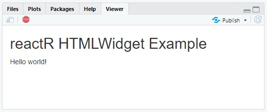

  
```{r, echo=FALSE, include=FALSE}
knitr::opts_chunk$set(eval = FALSE)
```

The [htmlwidgets](https://www.htmlwidgets.org) package provides a framework for creating R bindings to JavaScript libraries. Using the **htmlwidgets** package alone, it's not necessarily straight-forward to create an R binding to a [React](https://reactjs.org/)-powered JavaScript library. The **reactR** package builds on the **htmlwidgets** framework to make it much easier to author **htmlwidgets** that are powered by React. This vignette will show you how to effectively leverage **reactR** to build an **htmlwidgets** package that interfaces with [react-sparklines](https://github.com/borisyankov/react-sparklines) React JavaScript library.

## Software pre-requisites

In order to develop a **reactR** widget, you'll need to install R and optionally RStudio. If you're on Windows, you should also install [Rtools](https://cran.r-project.org/bin/windows/Rtools/).

> For an excellent general introduction to R package concepts, check out the [R packages](https://r-pkgs.org/) online book.

In addition, you'll need to install the following JavaScript tools on your machine:

* [Node.js](https://nodejs.org): JavaScript engine and runtime for development outside of browsers. Provides the `node` and `npm` commands.
* [Yarn](https://classic.yarnpkg.com/en/): Command-line dependency management tool, provides the `yarn` command.

To follow along in this vignette, you'll also need the following R packages:

```{r}
install.packages(c("shiny", "devtools", "usethis", "htmlwidgets", "reactR"))
```

## Scaffolding

To create a new widget you can call `scaffoldReactWidget` to generate the basic structure and build configuration. This function will:

* Create the .R, .js, .yaml, and .json files required by your widget;
* If provided, take an [npm](https://www.npmjs.com/) package name and version as a named list with `name` and `version` elements. For example, the npm package `foo` at version `^1.2.0` would be expressed as `list(name = "foo", version = "^1.2.0")`. The package, if provided, will be added to the new widget's `package.json` as a build dependency.

The following R code will create an R package named **sparklines**, then provide the templating for creating an htmlwidget powered by the `react-sparklines` npm package:

```{r}
# Create the R package
usethis::create_package("~/sparklines")
# Inject the widget templating
withr::with_dir(
  "~/sparklines", 
  reactR::scaffoldReactWidget("sparklines", list("react-sparklines" = "^1.7.0"), edit = FALSE)
)
```

## Building and installing

### Building the JavaScript

The next step is to navigate to the newly-created `sparklines` project and run the following R commands:

```{r}
system("yarn install")
system("yarn run webpack")
```

* `yarn install` downloads all of the dependencies listed in `package.json` and creates a new file, `yarn.lock`. You should add this file to revision control. It will be updated whenever you change dependencies and run `yarn install`. **Note: you only need to run it after modifying package.json**. For further documentation on `yarn install`, see the [yarn documentation](https://classic.yarnpkg.com/en/docs/cli/install/).

* `yarn run webpack` compiles the [ES2015](https://babeljs.io/docs/en/learn/) JavaScript source file at `srcjs/sparklines.js` into `inst/htmlwidgets/sparklines.js`. The later file is one actually used by the R package and includes all the relevant JavaScript dependencies in a version of JavaScript that most browsers understand. Note that, if you add `--mode=development` to the end of this command, it will include a [source map](https://firefox-source-docs.mozilla.org/devtools-user/debugger/how_to/use_a_source_map/index.html) is included with the compiled JavaScript, which makes JavaScript debugging much easier, but hopefully you won't need to do much of any JavaScript debugging.

`yarn run webpack` is not strictly a `yarn` command. In fact, `yarn run` simply delegates to the [webpack](https://webpack.js.org/) program.  Webpack's configuration is generated by `scaffoldReactWidget` in the file `webpack.config.js`, but you can always change this configuration and/or modify the `yarn run webpack` command to suit your needs.

### Installing the R package

Now that the widget's JavaScript is compiled, go ahead and install the R package:

```{r}
devtools::document()
devtools::install(quick = TRUE)
```

Alternatively, in RStudio, you can use the keyboard shortcuts `Ctrl+Shift+D` and `Ctrl-Shift-B` to document and build the package. (On macOS, the shortcuts are `Cmd+Shift+D` and `Cmd+Shift+B`)

## Run the included demo

Now that the widget's JavaScript is compiled, and the R package is installed, run `app.R` to see a demo in action:

```{r}
shiny::runApp()
```

Alternatively, in RStudio, you can open `app.R` and press `Ctrl-Shift-Enter` (`Cmd-Shift-Enter` on macOS). You should see something like the following appear in the Viewer pane:



## Authoring a React binding

At this point, we've built some scaffolding for an htmlwidget powered by React. Let's  modify it to create an interface to the `react-sparklines` library. Authoring the interface requires some changes on both the JavaScript and R side, but most of the hard thinking will be in figuring how best to design your interface. To give you an example of how this could work, let's build an interface to the `Sparklines` component of the react-sparklines library.

### First, outline an interface

> Note that the examples in this section are just to demonstrate API possibilities and need not be pasted into any file.

Consider the following example taken from the [react-sparklines documentation](http://borisyankov.github.io/react-sparklines/).

```js
import React from 'react';
import { Sparklines } from 'react-sparklines';

<Sparklines data={sampleData}>
  <SparklinesLine color="#56b45d" />
  <SparklinesSpots style={{ fill: "#56b45d" }} />
</Sparklines>
```

You have some choice in terms of how to design an R interface to this sort of React library, but usually it makes sense to have one function per component and have the arguments to that function feed into the properties of that React component. In other words, our goal is to create an R function that allows users of our package to recreate this example with the following code:

```r
library(sparklines)
sparklines(
  data = sampleData,
  sparklinesLine(color = "#56b45d"),
  sparklinesSpots(style = list(fill = "#56b45d"))
)
```

The following sections show how to implement this R interface from our scaffolded widget.

### R implementation

Consider the template that `reactR::scaffoldReactWidget()` provided for us:

```{r}
sparklines <- function(message, width = NULL, height = NULL, elementId = NULL) {
  
  # describe a React component to send to the browser for rendering.
  content <- htmltools::tag("div", list(message))
  
  # create widget
  htmlwidgets::createWidget(
    name = 'sparklines',
    reactR::reactMarkup(content),
    width = width,
    height = height,
    package = 'sparklines',
    elementId = elementId
  )
}
```

This function is designed to simply display a message within an HTML div using **reactR** and **htmlwidgets**. The critical piece here that makes it all work is `reactR::reactMarkup()`. This function can prepare a payload containing a mix of HTML tags (constructed via `htmltools::tag()`), React components (constructed via `reactR::component()`), or character vectors in a such way that the **reactR** and **htmlwidgets** toolchain will understand and know how to render in the browser (assuming we've imported our React component appropriately, as we cover later). Thus, to send a `<Sparklines>` react component instead of an HTML `<div>`, we could simply change:

```r
content <- htmltools::tag("div", list(message))
```

to

```r
reactR::component("Sparklines", list(message))
```

Remember, though, that we'd like `<Sparklines>` to consume a `data` property and also accept other valid components (e.g., `<SparklinesLine>`, `<SparklinesSpot>`, etc) from this library as children. So, we could change the body and signature of `sparklines()` in the following way:

```{r}
sparklines <- function(data, ..., width = NULL, height = NULL) {
  
  # describe a React component to send to the browser for rendering.
  content <- reactR::component(
    "Sparklines",
    list(data = data, ...)
  )
  
  # create widget
  htmlwidgets::createWidget(
    name = 'sparklines',
    reactR::reactMarkup(content),
    width = width,
    height = height,
    package = 'sparklines'
  )
}
```

At this point, we define functions that make it easy for the user to create the other components by adding these to  `R/sparklines.R`

```{r}
#' @export
sparklinesLine <- function(...) {
  reactR::React$SparklinesLine(...)
}

#' @export
sparklinesSpots <- function(...) {
  reactR::React$SparklinesSpots(...)
}
```

### JavaScript changes

In order for the **reactR** toolchain to know how to render components from the 'react-sparklines' library, we need to register the React components on the JavaScript side. This can be done in the `srcjs/sparklines.js` file which currently looks like this:

```{js}
import { reactWidget } from 'reactR';

reactWidget('sparklines', 'output', {});
```

First, `reactWidget` is [imported](https://developer.mozilla.org/en-US/docs/Web/JavaScript/Reference/Statements/import) from the `'reactR'` JavaScript module. This function will register the React components we want within the **reactR** and **htmlwidgets** toolchain. Note that the `'reactR'` JavaScript is an html dependency, but webpack is configured in `webpack.config.js` to consider it a module, so it's available to us here via `import` syntax.

Then, there's a call to `reactWidget`, and we pass it three arguments:

1. The name of the widget (`'sparklines'`)
1. The type of the widget (`'output'`)
1. The React components that should be exposed to the widget. In this template, we didn't have to include any because it's just rendering an HTML div. 

Instead of passing an empty object (`{}`) as the React components, we provide an object with all the components we need from the 'react-sparklines' module:

```{js}
import { Sparklines, SparklinesLine, SparklinesSpots } from 'react-sparklines';
import { reactWidget } from 'reactR';

reactWidget('sparklines', 'output', {
  Sparklines: Sparklines,
  SparklinesLine: SparklinesLine,
  SparklinesSpots: SparklinesSpots
});
```

### Go for a spin

Now that we've made the necessary changes to the JavaScript and R source code, it's time to compile the JavaScript and install the R package:

```{r}
system("yarn install")
system("yarn run webpack")
devtools::document()
devtools::install()
library(sparklines)
sparklines(rnorm(10), sparklinesLine())
```

This should open up the `sparklines()` widget in your browser. If it does, congratulations, you created a React-based htmlwidget!

### Shiny integration

The scaffolding template already provides the glue you need to get your **reactR** widget to render in **Shiny**. The two relevant functions are `renderSparklines()` and `sparklinesOutput()`. You shouldn't need to modify these functions — they should work out of the box. You will, however, want to modify the example **Shiny** app in the `app.R` file:

```{r}
library(shiny)
library(sparklines)

ui <- fluidPage(
  titlePanel("Sparklines library"),
  sliderInput("n", label = "Number of samples", min = 2, max = 1000, value = 100),
  sparklinesOutput("myWidget")
)

server <- function(input, output, session) {
    output$myWidget <- renderSparklines({
        sparklines(
            rnorm(input$n),
            sparklinesLine()
        )
    })
}

shinyApp(ui, server)
```

Now, when you run `shiny::runApp()`, you should see your react-based htmlwidget rendering in **shiny** app!


## Further learning

This tutorial walked you through the steps taken you create an R interface to the react-sparklines library. The full example package is accessible at <https://github.com/react-R/sparklines-example>. Our intention is keep creating example packages under the <https://github.com/react-R> organization, so head there if you'd like to see other examples of interfacing with React.
