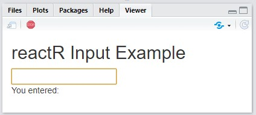

```{r, echo=FALSE, include=FALSE}
knitr::opts_chunk$set(eval = FALSE)
```

[Shiny](https://shiny.posit.co/) comes with a large library of input
[widgets](https://shiny.posit.co/r/gallery/widgets/widget-gallery/) for collecting
input from the user and conveying input data to R.

If you want a kind of input *not* provided by Shiny &mdash; like a color picker,
or a different kind of slider &mdash; you've always been able to build your own.
Shiny's input system is
[extensible](https://shiny.rstudio.com/articles/building-inputs.html). All
that's required is an understanding of certain conventions and a little custom
JavaScript.

reactR provides additional tools to ease the creation of new Shiny inputs
implemented using React. In the following tutorial, we will demonstrate these
tools by implementing a new Shiny color picker input that wraps the
[react-color](https://github.com/casesandberg/react-color) library.

## Software pre-requisites

In order to develop a **reactR** Shiny input, you'll need to install R and
optionally RStudio. If you're on Windows, you should also install
[Rtools](https://cran.r-project.org/bin/windows/Rtools/).

> For an excellent general introduction to R package concepts, check out the [R
> packages](https://r-pkgs.org/) online book.

In addition, you'll need to install the following JavaScript tools on your
machine:

* [Node.js](https://nodejs.org): JavaScript engine and runtime for development
  outside of browsers. Provides the `node` and `npm` commands.
* [Yarn](https://classic.yarnpkg.com/en/): Command-line dependency management tool,
  provides the `yarn` command.

To follow along in this vignette, you'll also need the following R packages:

```{r}
install.packages(c("shiny", "devtools", "usethis", "reactR"))
```

## Scaffolding

To create a new widget you can call `scaffoldReactShinyInput` to generate the basic
structure and build configuration. This function will:

* Create the .R, .js, and .json files required by your input;
* If provided, take an [npm](https://www.npmjs.com/) package name and version as
  a named list with `name` and `version` elements. For example, the npm package
  `foo` at version `^1.2.0` would be expressed as `list(name = "foo", version =
  "^1.2.0")`. The package, if provided, will be added to the new widget's
  `package.json` as a build dependency.

The following R code will create an R package named **colorpicker**, then
provide the templating for creating an input powered by the
`react-color` library on npm:

```{r}
# Create the R package (rstudio=TRUE is recommended if you're not already comfortable with your terminal)
usethis::create_package("~/colorpicker", rstudio = TRUE)
# Scaffold initial input implementation files
withr::with_dir(
  "~/colorpicker",
  reactR::scaffoldReactShinyInput("colorpicker", list("react-color" = "^2.17.0"), edit = FALSE)
)
```


## Building and installing

### Building the JavaScript

The next step is to navigate to the newly-created `colorpicker` project and run
the following commands in the terminal. If you're new the terminal, we recommend opening your newly created RStudio  `~/colorpicker/colorpicker.Rproj` project file, then running the following in the RStudio terminal tab:

```
yarn install
yarn run webpack
```

* `yarn install` downloads all of the dependencies listed in `package.json` and
  creates a new file, `yarn.lock`. You should add this file to revision control.
  It will be updated whenever you change dependencies and run `yarn install`.
  **Note: you only need to run it after modifying package.json**. For further
  documentation on `yarn install`, see the [yarn
  documentation](https://classic.yarnpkg.com/en/docs/cli/install/).

* `yarn run webpack` compiles the [modern JavaScript](https://babeljs.io/docs/en/babel-preset-env) 
  with [JSX](https://babeljs.io/docs/en/babel-preset-react) source file at `srcjs/colorpicker.jsx` into
  `www/colorpicker/colorpicker/colorpicker.js`. The latter file is the one
  actually used by the R package and includes all the relevant JavaScript
  dependencies in a dialect of JavaScript that most browsers understand.

`yarn run webpack` is not strictly a `yarn` command. In fact, `yarn run` simply
delegates to the [webpack](https://webpack.js.org/) program.  Webpack's
configuration is generated by `scaffoldReactShinyInput` in the file
`webpack.config.js`, but you can always change this configuration and/or modify
the `yarn run webpack` command to suit your needs.

### Installing the R package

Now that the input's JavaScript is compiled, go ahead and install the R
package:

```{r}
devtools::document()
devtools::install(quick = TRUE)
```

In RStudio, you can use the keyboard shortcuts `Ctrl-Shift-D` and
`Ctrl-Shift-B` to document and build the package. (On macOS, the shortcuts are
`Cmd-Shift-D` and `Cmd-Shift-B`)

## Run the included demo

Now that the input's JavaScript is compiled, and the R package is installed,
run `app.R` to see a demo in action:

```{r}
shiny::runApp()
```

In RStudio, you can open `app.R` and press `Ctrl-Shift-Enter`
(`Cmd-Shift-Enter` on macOS). You should see something like the following appear
in the Viewer pane:



## Authoring a React input

At this point, we have a working (if simple) React-powered text input.
Let's modify it to create an interface to the `react-color` library.

### Connecting Shiny with React

Consider the following example taken from the [react-color
documentation](http://casesandberg.github.io/react-color/).

```js
import React from 'react';
import { SketchPicker } from 'react-color';

class Component extends React.Component {

  render() {
    return <SketchPicker />;
  }
}
```

That JavaScript code produces a `SketchPicker`-type interface that looks like
this:


However, that example doesn't demonstrate a way to default to a particular
color, or a way to cause something to happen when the color changes. To
accomplish these, `react-color` components can [optionally
take](http://casesandberg.github.io/react-color/#api) the following
[props](https://reactjs.org/docs/components-and-props.html):

* [`color`](http://casesandberg.github.io/react-color/#api-color): accepts a 
  string of a hex color like `'#333'`
* [`onChangeComplete`](http://casesandberg.github.io/react-color/#api-onChangeComplete): 
  accepts a JavaScript function taking a single argument, the new `color`, that 
  will be called when the new color is selected

Since this React component calls a configurable function (i.e., `onChangeComplete`) when the input (i.e., color) value changes, we can supply a function to inform Shiny about these changes. You could, in theory, do this by writing your own custom Shiny input wrapper around this component, but `reactR` provides some conventions to make it much easier. These conventions have two main parts (R and JavaScript):

1. Use `reactR::createReactShinyInput()` to construct the user-facing R input and route any user-supplied options (e.g., the `default` input value and other `configuration`) to the React component. This part was already done for us in the `R/colorpicker.R` file of our colorpicker project:

```r
colorpickerInput <- function(inputId, default = "") {
  reactR::createReactShinyInput(
    inputId = inputId,
    class = "colorpicker",
    dependencies = htmltools::htmlDependency(
      name = "colorpicker-input",
      version = "1.0.0",
      src = "www/colorpicker/colorpicker",
      package = "colorpicker",
      script = "colorpicker.js"
    ),
    default = default,
    configuration = list(),
    container = htmltools::tags$span
  )
}
```

2. Design an *intermediate* React component that routes information from `colorpickerInput()` to the `<SketchPicker>` component and also inform Shiny when a new color is chosen. This intermediate component should be a [functional component](https://reactjs.org/docs/components-and-props.html#function-and-class-components) with three arguments:

* `configuration`: The JSON equivalent of the `configuration` argument from `reactR::createReactShinyInput()`. In this particular example, `configuration` isn't used.
* `value`: The input's values over time, beginning with the `default` supplied from `reactR::createReactShinyInput()`.
* `setValue`: A JavaScript function to call with the input's new value when one is created. This function is not user supplied, but rather an internal hook for informing Shiny about changes to the component's current state (i.e. value). 

Consider the following intermediate component, `PickerInput`. Note how this intermediate component allows one to set the default `value` from R and also calls `setValue()` inside `onChangeComplete` in order to inform Shiny about new color values. Finally, `reactR.reactShinyInput()` registers this intermediate component as a custom Shiny input binding named `colorpicker`.

```js
import { reactShinyInput } from 'reactR';
import { SketchPicker } from 'react-color';

const PickerInput = ({ configuration, value, setValue }) => {
  return (
    <SketchPicker
      color={ value }
      onChangeComplete={ color => setValue(color.hex) }
    />
  );
};

// Note the first argument here should match the `class` 
// argument of the reactR::createReactShinyInput() from step 1
reactShinyInput('.colorpicker', 'colorpicker', PickerInput);
```

Open the `srcjs/colorpicker.jsx` file in your colorpicker project and paste this code into it. After saving the file, run `yarn run webpack` in the terminal, re-install the
package, then run `shiny::runApp()` again

<video autoplay muted>
  <source src="./input_sketchpicker.mp4"/>
</video>

When you select new colors, you should see the `textOutput` update accordingly.

You might have noticed that the input showed up initially without a color
selected. That's because in `app.R` we didn't supply a `default` argument to the
`colorpickerInput` function inside our `ui`.

Try replacing the call to `colorpickerInput` with this:
`colorpickerInput("textInput", default = "#a76161")`

Now when you run the app, the color should start as a shade of red.

## Further learning

This tutorial walked you through the steps taken to wrap the `react-color`
library in a Shiny input. The full example package is accessible at
<https://github.com/react-R/colorpicker-example>. Our intention is keep creating
example packages under the <https://github.com/react-R> organization, so head
there if you'd like to see other examples of interfacing with React.
