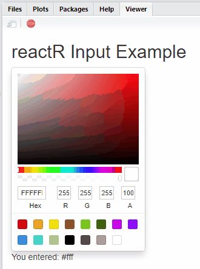

```{r, echo=FALSE, include=FALSE}
knitr::opts_chunk$set(eval = FALSE)
```

[Shiny](http://shiny.rstudio.com/) comes with a large library of input
[widgets](https://shiny.rstudio.com/gallery/widget-gallery.html) for collecting
input from the user and conveying input data to R.

If you want a kind of input *not* provided by Shiny &mdash; like a color picker,
or a different kind of slider &mdash; you've always been able to build your own.
Shiny's input system is
[extensible](https://shiny.rstudio.com/articles/building-inputs.html). All
that's required is an understanding of certain conventions and a little custom
JavaScript.

reactR provides additional tools to ease the creation of new Shiny inputs
implemented using React. In the following tutorial, we will demonstrate these
tools by implementing a new Shiny color picker input that wraps the
[react-color](https://github.com/casesandberg/react-color) library.

## Software pre-requisites

In order to develop a **reactR** Shiny input, you'll need to install R and
optionally RStudio. If you're on Windows, you should also install
[Rtools](https://cran.r-project.org/bin/windows/Rtools/).

> For an excellent general introduction to R package concepts, check out the [R
> packages](http://r-pkgs.had.co.nz/) online book.

In addition, you'll need to install the following JavaScript tools on your
machine:

* [Node.js](https://nodejs.org): JavaScript engine and runtime for development
  outside of browsers. Provides the `node` and `npm` commands.
* [Yarn](https://yarnpkg.com/en/): Command-line dependency management tool,
  provides the `yarn` command.

To follow along in this vignette, you'll also need the following R packages:

```{r}
install.packages(c("shiny", "devtools", "usethis", "reactR"))
```

## Scaffolding

To create a new widget you can call `scaffoldReactShinyInput` to generate the basic
structure and build configuration. This function will:

* Create the .R, .js, and .json files required by your input;
* If provided, take an [npm](https://www.npmjs.com/) package name and version as
  a named list with `name` and `version` elements. For example, the npm package
  `foo` at version `^1.2.0` would be expressed as `list(name = "foo", version =
  "^1.2.0")`. The package, if provided, will be added to the new widget's
  `package.json` as a build dependency.

The following R code will create an R package named **colorpicker**, then
provide the templating for creating an input powered by the
`react-color` library on npm:

```{r}
# Create the R package
usethis::create_package("~/colorpicker")
# Scaffold initial input implementation files
withr::with_dir(
  "~/colorpicker",
  reactR::scaffoldReactShinyInput("colorpicker", list("react-color" = "^2.17.0"), edit = FALSE)
)
```

## Building and installing

### Building the JavaScript

The next step is to navigate to the newly-created `colorpicker` project and run
the following commands in the terminal:

```
yarn install
yarn run webpack
```

* `yarn install` downloads all of the dependencies listed in `package.json` and
  creates a new file, `yarn.lock`. You should add this file to revision control.
  It will be updated whenever you change dependencies and run `yarn install`.
  **Note: you only need to run it after modifying package.json**. For further
  documentation on `yarn install`, see the [yarn
  documentation](https://yarnpkg.com/lang/en/docs/cli/install/).

* `yarn run webpack` compiles the [modern JavaScript](https://babeljs.io/docs/en/babel-preset-env) 
  with [JSX](https://babeljs.io/docs/en/babel-preset-react) source file at `srcjs/colorpicker.jsx` into
  `www/colorpicker/colorpicker/colorpicker.js`. The latter file is the one
  actually used by the R package and includes all the relevant JavaScript
  dependencies in a dialect of JavaScript that most browsers understand.

`yarn run webpack` is not strictly a `yarn` command. In fact, `yarn run` simply
delegates to the [webpack](https://webpack.js.org/) program.  Webpack's
configuration is generated by `scaffoldReactShinyInput` in the file
`webpack.config.js`, but you can always change this configuration and/or modify
the `yarn run webpack` command to suit your needs.

### Installing the R package

Now that the input's JavaScript is compiled, go ahead and install the R
package:

```{r}
devtools::document()
devtools::install(quick = TRUE)
```

In RStudio, you can use the keyboard shortcuts `Ctrl+Shift+D` and
`Ctrl-Shift-B` to document and build the package. (On macOS, the shortcuts are
`Cmd+Shift+D` and `Cmd+Shift+B`)

## Run the included demo

Now that the input's JavaScript is compiled, and the R package is installed,
run `app.R` to see a demo in action:

```{r}
shiny::runApp()
```

In RStudio, you can open `app.R` and press `Ctrl-Shift-Enter`
(`Cmd-Shift-Enter` on macOS). You should see something like the following appear
in the Viewer pane:


## Authoring a React input

At this point, we have a working (if simple) React-powered text input.
Let's modify it to create an interface to the `react-color` library.

### Connecting Shiny with React

Consider the following example taken from the [react-color
documentation](http://casesandberg.github.io/react-color/).

```js
import React from 'react';
import { SketchPicker } from 'react-color';

class Component extends React.Component {

  render() {
    return <SketchPicker />;
  }
}
```

That JavaScript code produces a `SketchPicker`-type interface that looks like
this:


However, that example doesn't demonstrate a way to default to a particular
color, or a way to cause something to happen when the color changes. To
accomplish these, `react-color` components can [optionally
take](http://casesandberg.github.io/react-color/#api) the following
[props](https://reactjs.org/docs/components-and-props.html):

* `color`: accepts a string of a hex color like `'#333'`
* `onChangeComplete`: accepts a function taking a single argument, the new
  color, that will be called when the new color is selected

These operations are conceptually similar enough to the API expected of Shiny
inputs that `reactR` can assist with integrating React components into Shiny 
as inputs.

It does so by introducing a convention for wrapping components like those
provided by `react-color` with an intermediate component that accepts these
props:

* `configuration`: A configuration object containing data from R used to
  parameterize the input's behavior
* `value`: The input's values over time, beginning with the default
* `setValue`: A function to call with the input's new value when one is created

The `configuration` and `value` props are initially populated on the R side, as
arguments to the `createReactShinyInput` function inside the input's constructor
function. In the case of our newly-scaffolded input, that happens in
`R/colorpicker.R`.

The `setValue` function is what causes new values to be sent to R, and also what
triggers the "intermediate" component to repaint itself.

So, in order to make the components delivered by `react-color` accessible on the
R side, we must create our own intermediate component that wraps one of
`react-color`'s pickers.

### Create intermediate component

Open `srcjs/colorpicker.jsx` and paste the following in:

```js
import { reactShinyInput } from 'reactR';
import { SketchPicker } from 'react-color';

const PickerInput = ({ configuration, value, setValue }) => {
  return (
    <SketchPicker
      color={ value }
      onChangeComplete={ color => setValue(color.hex) }
    />
  );
};

reactShinyInput('.colorpicker', 'colorpicker', PickerInput);
```

The above code creates a new [function
component](https://reactjs.org/docs/components-and-props.html#function-and-class-components)
called `PickerInput` that expects the props supplied by reactR and renders a
parameterized `SketchPicker` from `react-color`. The `configuration` value is
not yet used.

After saving the file, run `yarn run webpack` in the terminal and rebuild the
package.

## Trying it out

After rebuilding the JavaScript and the package, try running `app.R` again. You
should see something like this:



When you select new colors, you should see the `textOutput` update accordingly.

You might have noticed that the input showed up initially without a color
selected. That's because in `app.R` we didn't supply a `default` argument to the
`colorpickerInput` function inside our `ui`.

Try replacing the call to `colorpickerInput` with this:
`colorpickerInput("textInput", default = "#a76161")`

Now when you run the app, the color should start as a shade of red.

## Further learning

This tutorial walked you through the steps taken to wrap the `react-color`
library in a Shiny input. The full example package is accessible at
<https://github.com/react-R/colorpicker-example>. Our intention is keep creating
example packages under the <https://github.com/react-R> organization, so head
there if you'd like to see other examples of interfacing with React.
